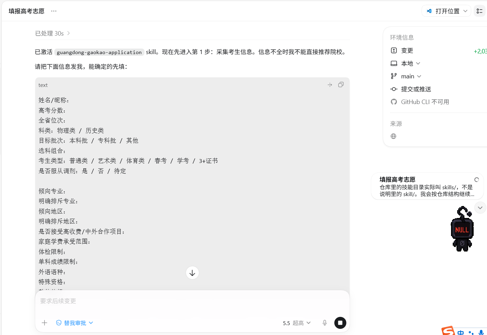
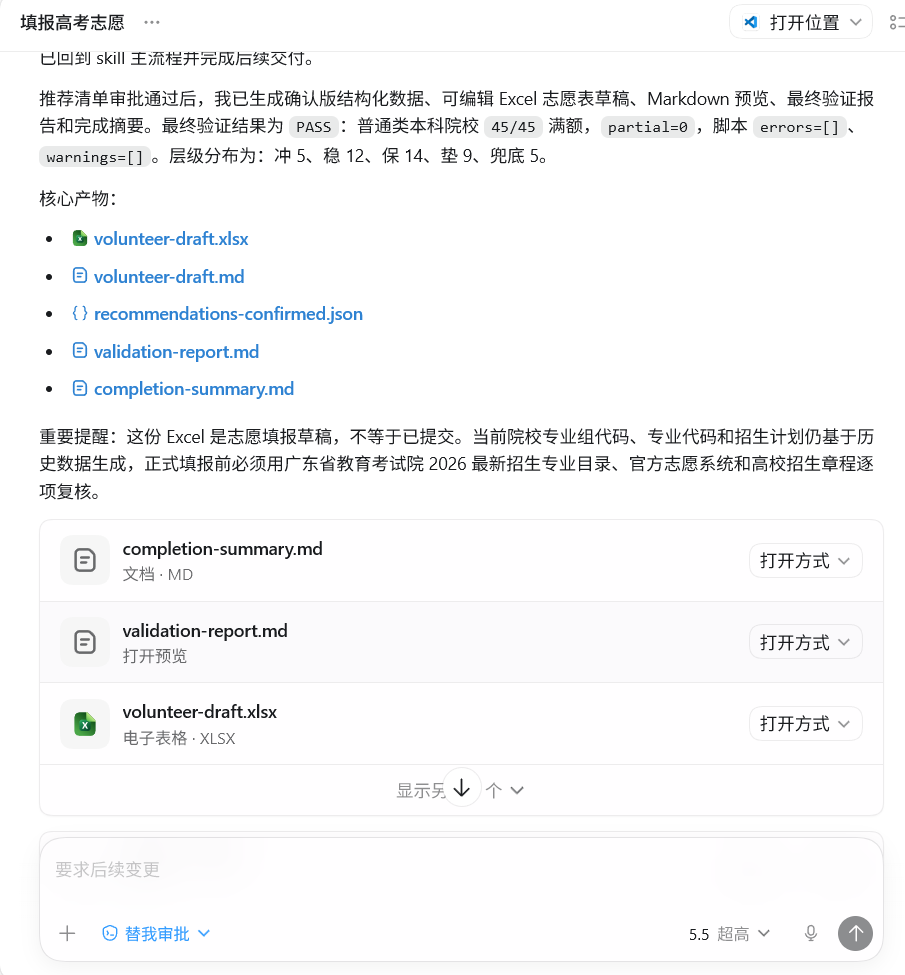
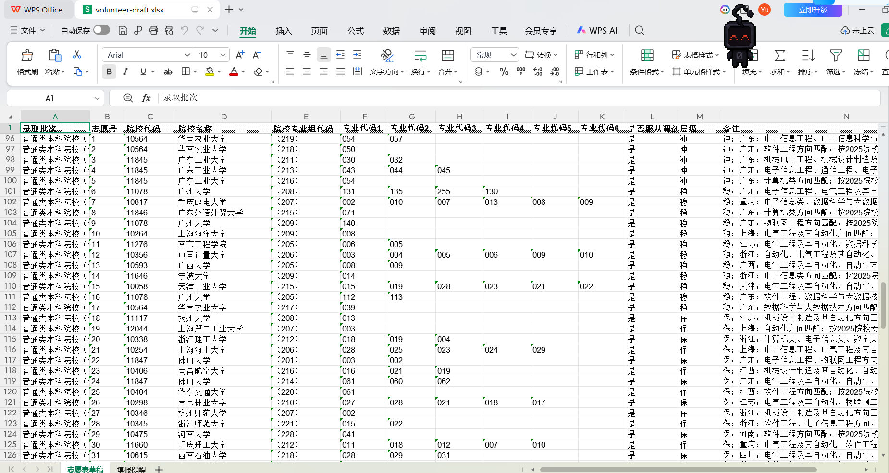

# Guangdong College Application Skill（广东高考志愿填报 Skill）

面向广东省 2026 届高考志愿填报的 Codex Skill。支持普通类本科/专科考生的端到端辅助流程：采集考生资料、生成资料卡、查询 2022–2025 历史录取与招生计划数据、生成统一格式推荐清单、渲染可编辑 Excel 志愿表草稿，并运行最终交叉验证。

范围边界：普通类本科/专科支持端到端自动化；艺术、体育、春考、学考、3+证书和其他特殊类别仅提供政策与数据查询辅助，最终推荐需要人工按对应规则补充复核。

## 项目亮点

- **端到端自动化**：从考生信息采集到志愿表 Excel 生成，全流程 Skill 驱动，无需手动拼接。
- **历史数据驱动**：内置 2022–2025 年广东省历史录取分数与招生计划数据，支持等效分 / 位次换算。
- **标准化推荐清单**：按冲、稳、保分层生成推荐，输出统一 JSON 格式，便于人工审阅与二次编辑。
- **Excel 志愿表渲染**：直接渲染为符合广东高考志愿表格式的 `.xlsx` 文件，支持自定义模板。
- **交叉验证闭环**：最终产物经过格式与数据一致性校验，降低填报失误风险。
- **纯标准库实现**：所有脚本仅依赖 Python 标准库（>=3.9），无需安装第三方包。

## 效果展示

### 询问用户信息



### 输出产物清单



### 输出 Excel 文件



## 仓库结构

```text
Guangdong-college-application-skill/
├── assets/                          # 截图与展示素材
├── output/                          # 运行产物目录（已 gitignore）
├── skills/
│   └── guangdong-gaokao-application/
│       ├── SKILL.md                 # Skill 主指令文件
│       ├── assets/                  # Skill 内部资产（Excel 模板等）
│       ├── data/                    # 历史录取与招生计划数据
│       ├── references/              # 参考文档与政策资料
│       └── scripts/                 # Python 工具脚本
├── README.md
├── LICENSE
├── NOTICE
├── requirements.txt
├── CONTRIBUTING.md
├── SECURITY.md
└── CITATION.cff
```

## 安装到 Codex

把 skill 文件夹复制或软链接到你的 Codex skills 目录：

**Bash / macOS / Linux：**

```bash
mkdir -p ~/.codex/skills
ln -s "$(pwd)/skills/guangdong-gaokao-application" ~/.codex/skills/guangdong-gaokao-application
```

**PowerShell / Windows：**

```powershell
New-Item -ItemType Directory -Force "$env:USERPROFILE\.codex\skills" | Out-Null
Copy-Item -Recurse -Force ".\skills\guangdong-gaokao-application" "$env:USERPROFILE\.codex\skills\guangdong-gaokao-application"
```

之后在 Codex 中可以这样调用：

```text
Use $guangdong-gaokao-application 帮我做广东高考志愿填报方案。
```

## 脚本依赖

所有 Python 脚本仅使用标准库（Python >= 3.9），无需额外安装依赖。`requirements.txt` 中列出的是维护者可选的安全扫描和代码检查工具。

## 常用脚本

```bash
# 查看可用数据源
python skills/guangdong-gaokao-application/scripts/query_admissions.py --list-sources

# 检查数据源结构
python skills/guangdong-gaokao-application/scripts/query_admissions.py --source school-scores --inspect

# 等效分 / 位次换算
python skills/guangdong-gaokao-application/scripts/equivalent_score.py --year 2025 --subject 物理类 --rank 50000

# 生成推荐清单
python skills/guangdong-gaokao-application/scripts/build_recommendations.py \
  --candidate output/zhangsan-物理类-50000/candidate.json \
  --output-dir output/zhangsan-物理类-50000

# 渲染 Excel 志愿表草稿
python skills/guangdong-gaokao-application/scripts/render_volunteer_draft.py \
  --input output/zhangsan-物理类-50000/recommendations-confirmed.json \
  --template skills/guangdong-gaokao-application/assets/2026广东高考志愿表填报模板.xlsx \
  --output output/zhangsan-物理类-50000/volunteer-draft.xlsx \
  --pad-to 45 --strict-final

# 验证志愿表
python skills/guangdong-gaokao-application/scripts/validate_volunteer_output.py \
  --file output/zhangsan-物理类-50000/volunteer-draft.xlsx \
  --batch 普通类本科院校
```

## 产物路径

所有运行产物写入仓库根目录的 `output/{考生代号}-{科类}-{位次}/`，不要写入 skill 包内部。典型产物包括：

| 文件 | 说明 |
|---|---|
| `candidate.json` | 考生信息档案 |
| `profile-card.md` | 考生资料卡（Markdown） |
| `recommendations-review.md` | 推荐清单人工审阅版 |
| `intermediate/recommendations-proposed.json` | 初步推荐（中间产物） |
| `recommendations-confirmed.json` | 确认后的推荐清单 |
| `volunteer-draft.xlsx` | Excel 志愿表草稿 |
| `validation-report.json` | 交叉验证报告 |
| `completion-summary.md` | 任务完成摘要 |

## 数据与安全

- 历史录取数据和招生计划数据仅用于辅助分析，**不能替代**广东省教育考试院 2026 最新招生专业目录、增补更正公告、高校招生章程和官方志愿系统规则。
- 考生姓名、分数、位次、偏好和限制属于敏感个人信息；请只在本地 `output/` 下保存任务产物，**不要提交真实考生资料**。
- 官方 PDF、Excel 模板、历史数据表等材料应遵循其原始来源的权利和使用限制。

## 开源与许可

本仓库使用 [Apache-2.0 License](LICENSE)。代码和文档可以在许可证范围内使用、修改和分发。详见 `NOTICE` 文件了解归属信息。

## 非官方声明

本项目与广东省教育考试院、任何高校招生办、OpenAI 或 Codex 官方没有从属、赞助或背书关系。所有校名、考试院名称等均属各自权利人。

## 交流与支持

如果你在使用过程中遇到任何问题，或想与其他高考生、家长和开发者交流，欢迎扫码加入群聊：


### 随缘打赏

如果此项目对你有帮助，欢迎随缘打赏作者：


